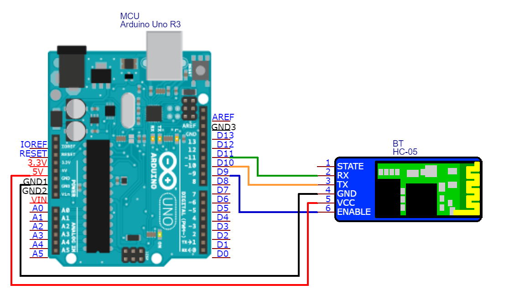
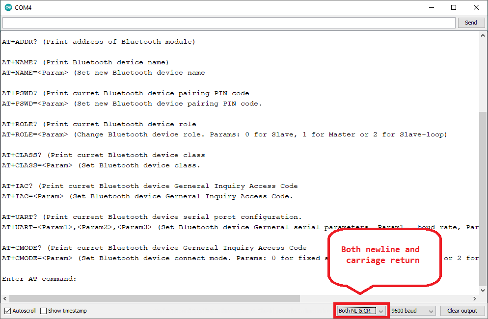

# HC-05_AT
HC-05 Bluetooth module AT mode configurator

## What is this?
Just a small Arduino application for configuring HC-05 Bluetoot module via serial console. It contain list of available commands and common usage patterns.

### What is AT mode?
In order to change default configuration parameters of your Bluetooth module (such as device name, PIN code, ...) You need to put your device in AT mode first. This can be done in one of following two ways:  
1. Setting EN pin on HC-05 module to HIGH while powering on HC-05
2. Some HC-05 modules are equipped with small hardware button (next to EN pin). If Your device is equipped with one, all you need to do in order to enter AT mode is to keep this button pressed while powering on HC-05 module.

### How do I know if I am in AT mode?
Once you successfully enter AT mode, your HC-05 LED will start blinking very slowly (with 3 second interval)

### How it works?
Very good, thanks for asking! It creates two serial interfaces and simply passes through commands from and to each other. First serial interface is default Arduino hardware serial interface (commonly accessed via USB), while for second we use SoftwareSerial.h library in order to emulate software serial interface (a.k.a bit-banging) and attach it to HC-05 Bluetoot module.

## Wiring
**Default pinout (tested):**  

Legend:  
HC-05 **EN_**  Arduino **D9**  
HC-05 **TXD**  Arduino **D10**  
HC-05 **RXD**  Arduino **D11**  
HC-05 **GND**  Arduino **GND**  
HC-05 **VCC**  Arduino **5V**  

## Serial console configuration
**In order to pass through commands from one serial interface to another, both newline and carriage return must be selected as newline characters.** For more details, check out picture below:  

## AT command list
*Need editing*
Once you upload this scatch to Arduino and open serial port monitor, list of common AT command with typical usage pattern will be displayed.
